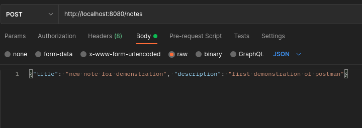
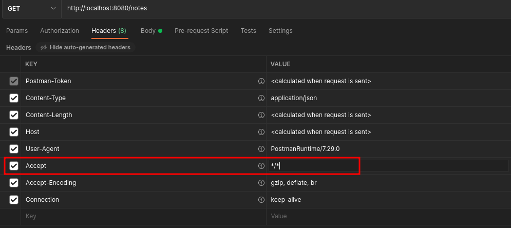
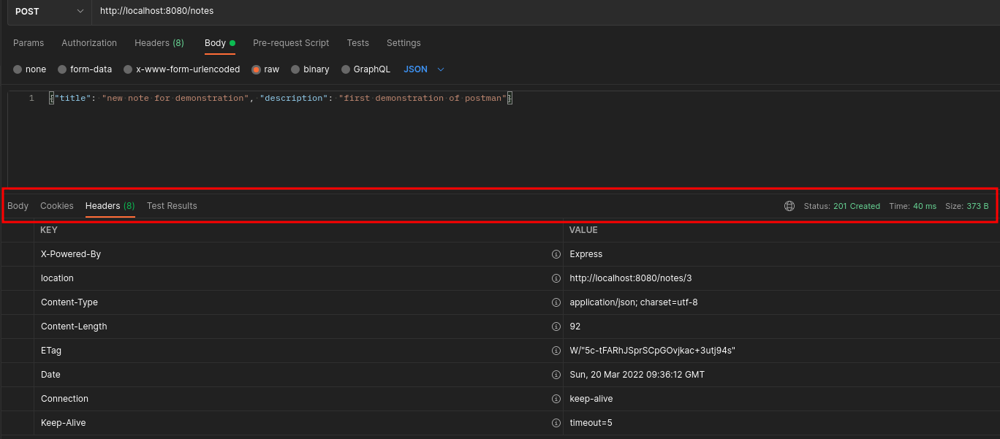

# ReST Web Service Example

## **Introduction to RESTful Web Services**

### **What Are RESTful Web Services?**
REST (Representational State Transfer) is an **architectural style** for designing networked applications. RESTful Web Services allow **clients and servers to communicate** using standard HTTP methods and structured URIs. REST is widely used for **APIs** that expose data and functionality over the web.

### **How REST Differs from Traditional Web Communication?**
| **Feature**       | **Traditional Web Pages**         | **REST API**                                                 |
|-------------------|-----------------------------------|--------------------------------------------------------------|
| **Purpose**       | Renders HTML for user interaction | Provides structured data for applications                    |
| **Communication** | Browser requests pages            | API calls return JSON or XML                                 |
| **State**         | Can maintain session state        | Stateless requests (each request is independent)             |
| **Best For**      | User interfaces, websites         | Machine-to-machine communication, mobile apps, microservices |

### **When to Use REST APIs?**
RESTful Web Services are ideal for **exposing data and functionalities** to different applications, such as:
- **Web and mobile applications consuming backend services**
- **IoT devices fetching remote data**
- **Microservices interacting with each other**
- **Third-party integrations (e.g., payment gateways, social media APIs)**

### **How REST Works – A Basic Flow**
1. **Client sends an HTTP request** to a REST API using standard methods (`GET`, `POST`, `PUT`, `DELETE`).
2. **Server processes the request** and interacts with a database if necessary.
3. **Server sends back a response** in JSON or XML format.
4. **Each request is stateless**, meaning no client data is stored between requests.

This exercise will guide you through **building a REST API using Express.js**, handling CRUD operations, structuring endpoints properly, and responding with correct HTTP status codes.


## About the exercise(s)

> For this exercise, we provide a base [node](https://nodejs.org/en/) / [express](https://expressjs.com/) application, which should be extended by you.

> **DOCUMENTATION**: Important for this and upcoming exercises is to create a documentation of ALL checkpoints, create a [repository](https://git-iit.fh-joanneum.at/msd-webserv/ss25-stduents)

> **CHECKPOINT**: You will find multiple **CHECKPOINTS** during this and all other exercise. When you pass that checkpoint, ask your lecturer to check your steps to get points for grading. In some cases only a Screenshot and a Teams message is necessary to indicate your current state.

## Prerequisites
* [Node](https://nodejs.org/en/)
  * we recommend current [LTS](https://nodejs.org/dist/latest-v22.x/)


## First Steps
install current dependencies
```console
npm install
```
or with existing project also possible
```console
npm ci
```

On Windows, you may get an error on `npm ci`. When it doesn't work, try to install the latest version of [sqlite3](https://www.npmjs.com/package/sqlite3) first and then (again) the other dependencies:
```console
npm install sqlite3@latest
npm install
```
You should then use sqlite3 package version **5.x.x**.

### #What comes with this project?

* [express](https://expressjs.com/), fast web framework to create web-services
```console
npm install --save express
 ```
* [dotenv](https://www.npmjs.com/package/dotenv) to load custom environment variables from [`.env`](.env.EXAMPLE) file, what includes following configuration in this case
  * `PORT` to access web-service on PORT 8080
  * `DATABASE_URL` to define sqlite file to create/use database file 
```console
 npm install --save dotenv
```
* [sqlite3](https://www.npmjs.com/package/sqlite3), module to work with SQLite database for persistence
```console
npm install --save sqlite3
 ```

### Project structure

> *
> * └───[`notes`](notes): directory for our 'notes' resource
>   * [`controller.js`](notes/controller.js): "business" logic to handle different HTTP calls on 'notes' resource.
>   * [`index.js`](notes/index.js): routing configuration for 'notes' resource
>   * [`model.js`](notes/model.js): db handler for 'notes' resource
> * └───[`public`](public): directory with minimal frontend
> * └─── [`util`](util): directory for utility files
> * [`config.js`](util/config.js): setup configurations, read/set environment variables (e.g. port)
> * [`package.json`](package.json): node configuration/dependencies file
> * [`server.js`](server.js): start point for our web-service and webserver. setups express and starts listener.

start application server
```bashvb 
node server.js
## or
npm start
```

## Quick Overview about REST Structure

depending on the REST example of notes management, we will take a quick look at important relations between REST, HTTP and SQL. 

| 	URL		    | 	HTTP Verb	 | 	CRUD 	     | 	SQL   		  | 	comment 	   		       |
|-----------|-------------|-------------|------------|-----------------------|
| /notes	   | POST 		     | 	CREATE		   | 	INSERT	   | insert new note  		   |
| /notes    | GET 			     | 	READ		     | 	SELECT  	 | read **all** notes  	 |
| /notes/1  | GET 			     | 	READ		     | 	SELECT  	 | read **one** note 	   |
| /notes/1	 | PUT 			     | 	UPDATE	  	 | 	UPDATE	   | update **one** note	  |
| /notes/1	 | DELETE		    | 	DELETE  		 | 	DELETE  	 | removes **one** note  |

check it out with your browser, [cURL](https://curl.se/) or [Postman](https://www.postman.com/) for example.

use [Postman Collection](https://www.postman.com/fhj-iit/web-service-development-public/collection/vhsvdem/webservdev-rest-first-introduction?action=share&creator=20882607) for quick start and to do first API calls

[](https://app.getpostman.com/run-collection/33374791-4c9a9b48-0758-45e3-8842-2d127a0d57c2?action=collection%2Ffork&source=rip_markdown&collection-url=entityId%3D33374791-4c9a9b48-0758-45e3-8842-2d127a0d57c2%26entityType%3Dcollection%26workspaceId%3Ddc1d8623-72a1-4c18-ba55-78a5fdf44dea)


When everything is up and running, checkout the code. Take a look at the structure and answer the following

* What will be the **status code** of each (successful) action?
* What happens when you **POST** the same data multiple times?
* What happens when you **POST** or **PUT** invalid data?

> **CHECKPOINT RE-001: Create a document and answer above questions. Also indicate your current state within the teams call.**


## Extending the API
 
As you noticed above, this ReST API is very simple and does not handle errors well. It is now in you to extend/improve the API.

### User Input

With **POST** and **PUT**, a user is able to insert data in our system. It is always a bad idea to trust user input without a check.

Extend the `createAction` and `updateAction`, to be only accept "valid data". When you receive invalid data, return an error-object to
the client using a useful error-message and status code.

"valid data" in our case means:
* the fields `title` and `description` must be part of the request and of type "string"
* `title` must have at least 3 characters, `description` at least 5

**Example Validation by yourself**:
```js
  const { firstname, lastname } = req.body;

  // manual validation
  if (!firstname || typeof firstname !== "string" || firstname.length < 10) {
    return res.status(400).json({ error: "Firstname must be at least 10 characters long." });
  }
```

your webservice should not be crash when invalid data has been provided!

\[OPTIONAL\]: manually checks could be very annoying, especially when you have much more fields than just two. A more efficient way is to use a library for that, 
providing rules to work with. When enough time is left, checkout [express-validator](https://express-validator.github.io/docs/) to solve that kind of problem.

**Example Validation with Middleware**:
```js
const { body, validationResult } = require("express-validator");

// Middleware for Validation Example with field "firstname"
const validateFirstname = [
  body("firstname")
    .isString().withMessage("Firstname must be a string.")
    .isLength({ min: 10 }).withMessage("Firstname must be at least 10 characters long."),
  (req, res, next) => {
    const errors = validationResult(req);
    if (!errors.isEmpty()) {
      return res.status(400).json({ errors: errors.array() });
    }
    next();
  },
];

// API-Route with Middleware
app.post("/users", validateFirstname, (req, res) => {
  const { firstname } = req.body;

  // Simulierte Speicherung in der Datenbank
  const newUser = { id: Date.now(), firstname };
  
  res.status(201).json(newUser);
});


```

*Working with Postman:* Below the address-bar, select the **Body** tab, use **raw** as input type and add your data in JSON-format.



*Working with CuRL:*
```curl
curl -X POST http://localhost:8080/notes -H "content-type: application/json" -d '{"title":"new note","description":"this is a new note"}'
```
* `-X POST`: use POST
* `-H "..."`: add header (need to be done for each header separately!)
* `-d "..."`: send following data in body


> **CHECKPOINT RE-002: Update your document and add screenshots and code-snippets, that show that you handle successfully error-inputs for PUT and POST.**


### Headers

Most of the time we only pay attention to the response body when working with web resources. But there is much more information that we can work with.
Next to the status codes, we can also offer additional headers in our response, as well as we can check in the request.

It is a good approach to not only return the created resource on a POST, we should also return a [`Location`-Header](https://developer.mozilla.org/en-US/docs/Web/HTTP/Headers/Location), pointing to the newly created resource.

For that, extend the `createAction` to add a `location` header, before you send the response. The header should include the URI for the new created resource (e.g. *http://localhost:8080/notes/5*).
Checkout the [Response `set`](https://expressjs.com/en/4x/api.html#res.set) function for that.


Not only in responses headers appear, also in requests you will find headers that could give you additional information, given by the user calling.

For example the [`Accept`-Header](https://developer.mozilla.org/en-US/docs/Web/HTTP/Headers/Accept), with that the client could ask for a specific format for the response.
Because we only will response JSON at this point, extend your API to return an error, when something other then `application/json`, `*/json` or `*/*` will be accepted by the client.

\[OPTIONAL\]: Where to check for the request header? In each route separate? Possible, but maybe this will end in a bunch of code-duplication/repeated call for the same function. When enough time is left, checkout [express middleware](https://expressjs.com/en/guide/using-middleware.html).

*Working with Postman (set Request Header):* Below the address-bar, select the **Headers** tab and update the value of the `Accept` Header before sending.


*Working with Postman (check Response Header):* In the response area, select the **Headers** tab and checkout the headers received from the server.


*CuRL set Request Header:* use the option `-H`, followed by the `"header: value"`, e.g.
```curl
curl -H "accept: application/json" -H "custom-header: some text" http://localhost:8080/notes
```

*CuRL check Response Header:* use the option `-v` to show response headers
```curl
curl -v http://localhost:8080/notes

*   Trying 127.0.0.1:8080...
* Connected to localhost (127.0.0.1) port 8080 (#0)
> GET /notes HTTP/1.1
> Host: localhost:8080
> User-Agent: curl/7.82.0
> Accept: */*
>

* Mark bundle as not supporting multiuse
< HTTP/1.1 200 OK
< X-Powered-By: Express
< Content-Type: application/json; charset=utf-8
< Content-Length: 213
< ETag: W/"d5-vIbf7OTpjPxBg1sq6mIR/wyaImg"
< Date: Sun, 20 Mar 2022 09:42:03 GMT
< Connection: keep-alive
< Keep-Alive: timeout=5
<

* Connection #0 to host localhost left intact
[{"id":1,"title":"first","description":"first note"},{"id":2,"title":"learn rest","description":"learn how rest works"},{"id":3,"title":"new note for demonstration","description":"first demonstration of postman"}]
```

> **CHECKPOINT RE-003: Update your document and add screenshots and code-snippets, that show that you extended your POST response with the location-Header, and only handle requests that accept JSON response (when time is running out, simple implement the check in one HTTP-Method (e.g. GET)).**


### CORS and clients

[Cross-Origin Resource Sharing (CORS)](https://developer.mozilla.org/en-US/docs/Web/HTTP/CORS) is a security feature, that allows a server to identify - and with that - allow or disallow a client to access it resources. For that, it uses the `origins`-Header. Because that is easily to "fake", it is not a real security feature on the server side, but on the client (especially browsers), where they can check if requested resources (e.g. via [fetch](https://developer.mozilla.org/en-US/docs/Web/API/Fetch_API)) is coming from a trusted location.

Per default, CORS is not *"active"*. Use the npm package [cors](https://www.npmjs.com/package/cors) to extend your service.

After install, add the following line to the [`server.js`](server.js), before you set the different routes.

```javascript
// ...
const cors = require('cors');
// ...

app.use(cors());

// ...
```

This allows CORS on **all** requests. (it sets the `Access-Control-Allow-Origin`-Header to `*`). With the npm-package, you are now able to allow only specific origins to handle your data. When someone other will access it, the browser will return an error.

> **ATTENTION**: This is no security for accessing your API! CORS is used to provide client side security against possible external, malicious data. As long as the `Access-Control-Allow-Origin` Header is set by the sever correctly, you always will get access to the data in the browser!  
> **We will take a look into Authentication in a later lecture**.

Now with CORS allowed for everyone, checkout the [client](http://localhost:8080/client). This is a simple web frontend, consuming our API. It already has a form added, to POST new data to your API, but it is not fully implemented. Extend the [`client.js`](public/client.js) to POST the data, given by the form, to the server and display the responded new note. For that, checkout the [Fetch API](https://developer.mozilla.org/en-US/docs/Web/API/Fetch_API) and example inside of [`client.js`](public/client.js).

**Hint**:

* **NOT** working with CORS: [http://localhost:8080/client](http://localhost:8080/client)
* working with CORS **active**: [http://127.0.0.1:8080/client](http://127.0.0.1:8080/client)
* working with CORS **disabled** by code integration: [http://localhost:8080/client](http://localhost:8080/client)


> **CHECKPOINT RE-004: Update your document and add screenshots and code-snippets, that show that your client could sucessfully add new notes and display them, without the need of a reload of the side.**


## New Endpoint(s)

Now, that you're familiar with the usage of express and implementing a (simple) ReST API, create a new endpoint for **users**. Checkout the [slides](https://elearning.fh-joanneum.at/pluginfile.php/73875/mod_resource/content/0/02_rest%28ful%29_webservice_pn.pdf) (*page 12*) to get an idea, how the resource model for users will look like.

A user consists of:
* `id`: number, auto-generated
* `name`: string
* `address`: object
  * `street`: string
  * `number`: string,
  * `zip`: number,
  * `city`: string


> **CHECKPOINT RE-005: Update your document and add screenshots and code-snippets, that show that your `/users` endpoint is working.**

\[OPTIONAL\]: Also `/users/<id>/address` work as shown in the [slides](https://elearning.fh-joanneum.at/pluginfile.php/73875/mod_resource/content/0/02_rest%28ful%29_webservice_pn.pdf) and [additional instructions](users.md) 


## References
* [Node - Das umfassende Handbuch](https://www.rheinwerk-verlag.de/nodejs-das-umfassende-handbuch/)

## Useful links
* [express framework](https://expressjs.com/)
* [SQLite](https://www.sqlite.org/docs.html)
* [HTTP Methods](https://restfulapi.net/http-methods/)
* [HTTP Status Codes](https://restfulapi.net/http-status-codes/)
* [JavaScript: arrow function vs. regular function](https://levelup.gitconnected.com/arrow-function-vs-regular-function-in-javascript-b6337fb87032)
* [Set Location Header](https://stackoverflow.com/questions/14943607/how-to-set-the-location-response-http-header-in-express-framework)
