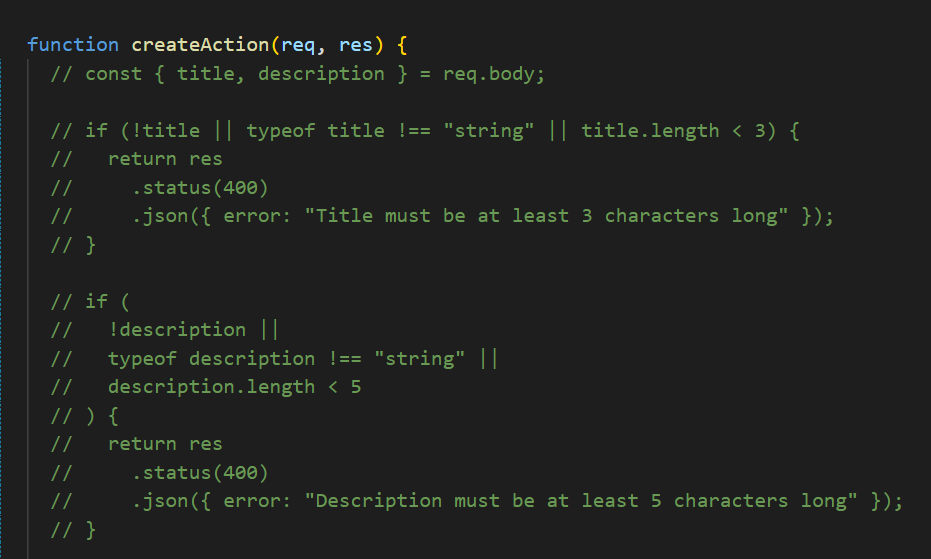
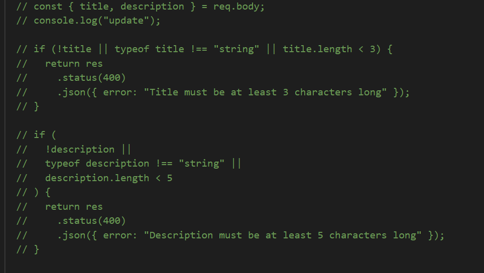
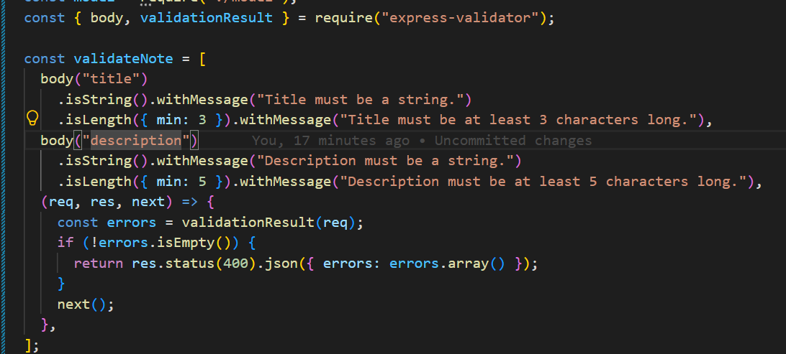
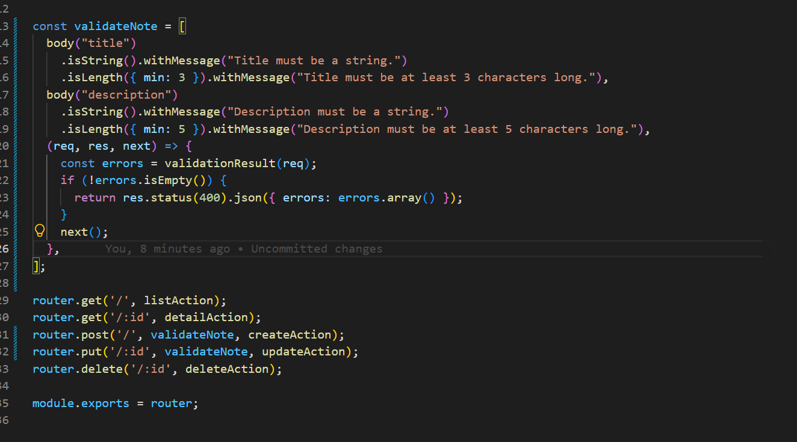
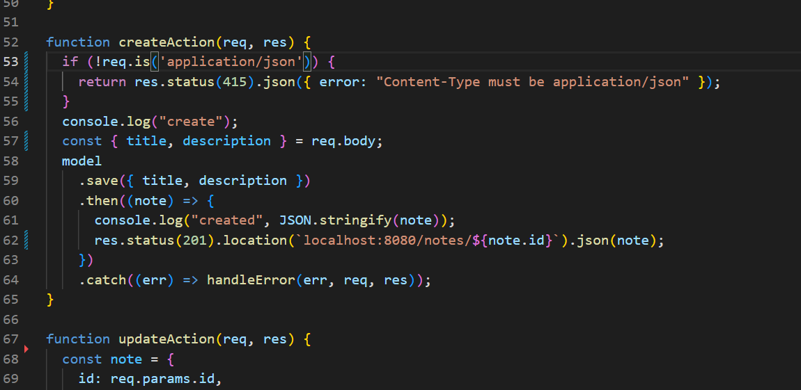
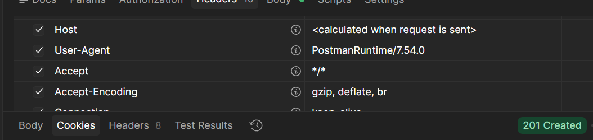
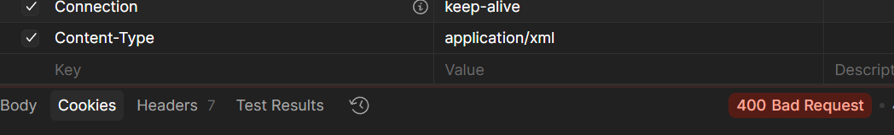

# Dokumentation

## Checkpoints

1. C001

\
Frage 1: Welchen Statuscode erhält jede (erfolgreiche) Aktion?

GET http://localhost:8080/notes (all notes)

200 OK

GET http://localhost:8080/notes/1 (single note)

200 OK

POST http://localhost:8080/notes (Create new note)

201 created

PUT http://localhost:8080/notes/3 (Update note)

200 OK

DEL http://localhost:8080/notes/3 (delte note)

204 No Content

\
Frage 2: Was passiert, wenn man dieselben Daten mehrmals per POST sendet?

Es wird jedes mal eine neue Note erstellt (201 created)

\
Frage 3: Was passiert, wenn ungültige Daten per POST oder PUT gesendet werden?

Es funktioniert hier fehler frei. POST erstellt eine neue note und PUT updatet die note die ausgewählt wird

\
Frage 4: Was passiert, wenn Sie eine Ressource anfordern, die nicht existiert?

GET 404 Not Found 

PUT erstellt die note mit der zuvor nicht ecistenten id

DLEETE gibt einfach 204 No Content

2. C002

manuell

automated validation

3. C003

